# 全栈全端 IM 即时通信产品 — 详细设计文档

> 文档版本：v1.0  
> 创建日期：2026-04-26  
> 技术栈：Rust (Actix-web) + Vue 3 + WebSocket  
> UI 风格：可爱友好风格

---

## 目录

1. [架构设计](#1-架构设计)
2. [设计模式](#2-设计模式)
3. [分层架构](#3-分层架构)
4. [UI 设计规范](#4-ui-设计规范)
5. [功能实现提示](#5-功能实现提示)
6. [数据模型设计](#6-数据模型设计)
7. [消息协议设计](#7-消息协议设计)

---

## 1. 架构设计

### 1.1 整体架构图

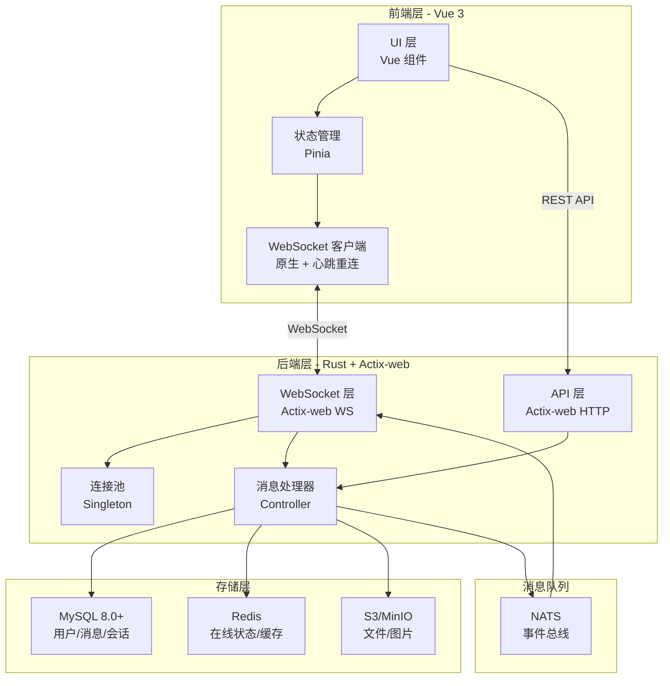

### 1.2 前端架构（Vue 3）

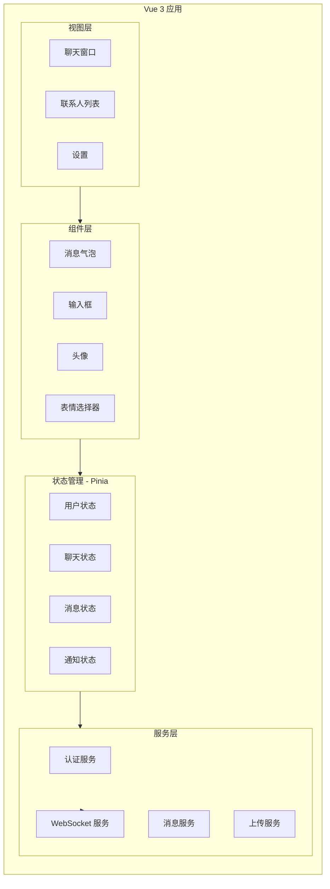

**前端技术栈**：
- **框架**：Vue 3 + Composition API
- **状态管理**：Pinia（替代 Vuex，更轻量且 TS 友好）
- **构建工具**：Vite
- **UI 组件库**：Naive UI / PrimeVue（支持自定义主题）
- **WebSocket**：原生 WebSocket + 心跳重连封装
- **图标**：Lucide Vue / Phosphor Icons（小清新风格）

### 1.3 后端架构（Rust + Actix-web）

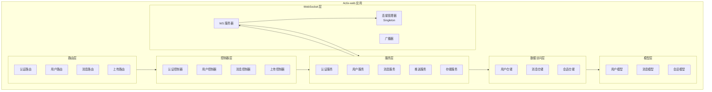

**后端技术栈**：
- **Web 框架**：Actix-web 4.x
- **异步运行时**：Tokio
- **ORM**：SeaORM
- **数据库**：MySQL 8.0+
- **缓存**：Redis 7+
- **消息队列**：NATS
- **序列化**：Serde + Protobuf

---

## 2. 设计模式

### 2.1 MVC (Model-View-Controller)

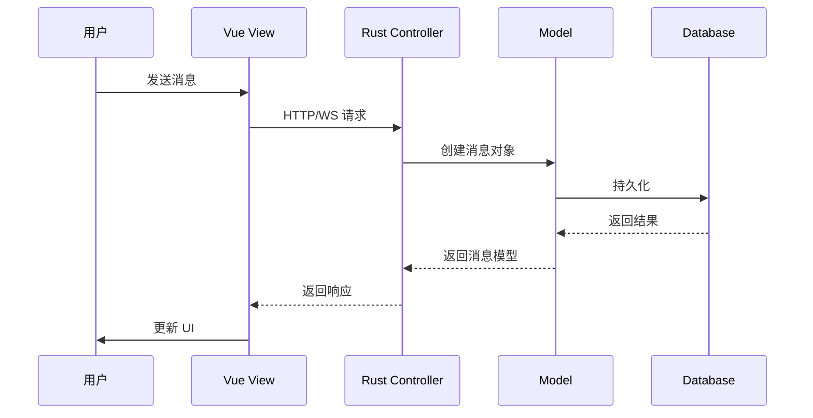

**实现说明**：

| 层 | 职责 | 实现位置 |
|----|------|---------|
| **Model** | 定义数据结构、业务逻辑 | Rust `models/` + Vue `types/` |
| **View** | UI 展示、用户交互 | Vue `components/` + `views/` |
| **Controller** | 处理请求、协调服务 | Rust `controllers/` |

### 2.2 Observer (观察者模式)

用于 WebSocket 消息推送，当消息状态变化时通知所有订阅者。

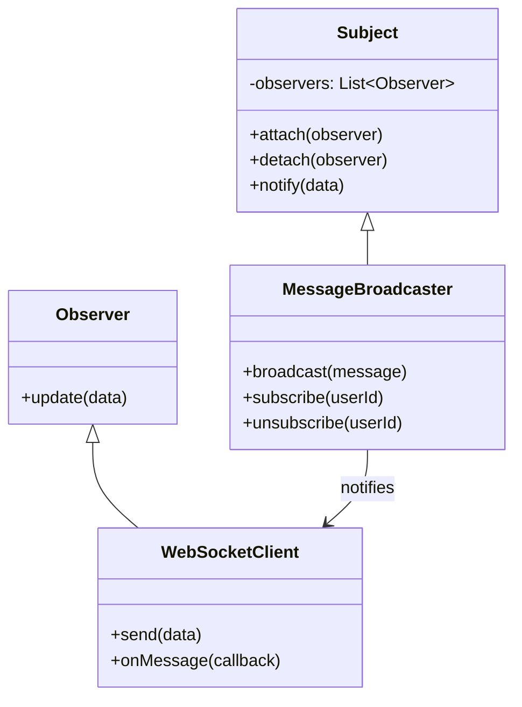

**Rust 实现示例**：

```rust
// 观察者特质
trait Observer {
    fn update(&self, data: &Message);
}

// 被观察者
struct MessageBroadcaster {
    observers: HashMap<UserId, Vec<Arc<dyn Observer>>>,
}

impl MessageBroadcaster {
    fn broadcast(&self, message: &Message) {
        if let Some(observers) = self.observers.get(&message.receiver_id) {
            for observer in observers {
                observer.update(message);
            }
        }
    }
}
```

### 2.3 Factory (工厂模式)

用于创建不同类型的消息对象（文本、图片、文件、语音等）。

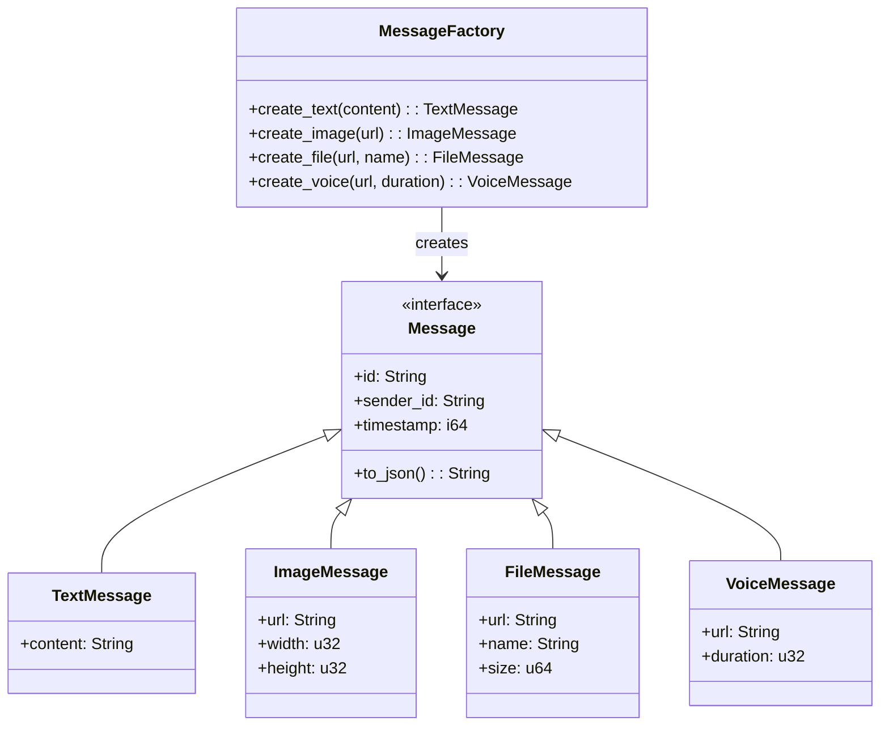

**Rust 实现示例**：

```rust
enum MessageType {
    Text,
    Image,
    File,
    Voice,
}

enum Message {
    Text(TextMessage),
    Image(ImageMessage),
    File(FileMessage),
    Voice(VoiceMessage),
}

struct MessageFactory;

impl MessageFactory {
    fn create_text(content: String) -> Message {
        Message::Text(TextMessage { content })
    }

    fn create_image(url: String, width: u32, height: u32) -> Message {
        Message::Image(ImageMessage { url, width, height })
    }
}
```

### 2.4 Singleton (单例模式)

WebSocket 连接池使用单例模式，保证全局只有一个连接管理器实例。

```mermaid
classDiagram
    class ConnectionManager {
        -instance: ConnectionManager
        -connections: HashMap~UserId, WebSocket~
        +get_instance(): ConnectionManager
        +add_connection(user_id, ws)
        +remove_connection(user_id)
        +get_connection(user_id): WebSocket
        -ConnectionManager()
    }
    class WebSocket {
        +send(data)
        +close()
    }

    class ConnectionManager$ {
        <<static>>
        +instance: ConnectionManager
    }

    ConnectionManager$ --> ConnectionManager : manages
    ConnectionManager --> WebSocket : holds
```

**Rust 实现示例**：

```rust
use std::sync::{Arc, Mutex};
use std::collections::HashMap;

struct ConnectionManager {
    connections: HashMap<UserId, WebSocket>,
}

impl ConnectionManager {
    fn new() -> Self {
        Self {
            connections: HashMap::new(),
        }
    }
}

// 使用 OnceLock 实现单例
use std::sync::OnceLock;

static MANAGER: OnceLock<Arc<Mutex<ConnectionManager>>> = OnceLock::new();

fn get_manager() -> Arc<Mutex<ConnectionManager>> {
    MANAGER.get_or_init(|| {
        Arc::new(Mutex::new(ConnectionManager::new()))
    }).clone()
}
```

---

## 3. 分层架构

### 3.1 前端分层架构

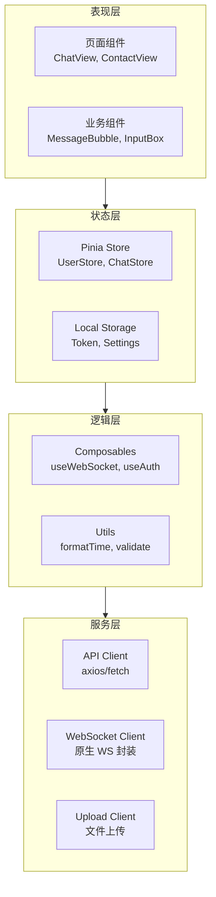

**目录结构**：

```
frontend/
├── src/
│   ├── views/           # 页面组件
│   │   ├── ChatView.vue
│   │   ├── ContactView.vue
│   │   └── SettingsView.vue
│   ├── components/      # 业务组件
│   │   ├── MessageBubble.vue
│   │   ├── InputBox.vue
│   │   ├── Avatar.vue
│   │   └── EmojiPicker.vue
│   ├── stores/          # Pinia 状态管理
│   │   ├── user.ts
│   │   ├── chat.ts
│   │   └── message.ts
│   ├── composables/     # 组合式函数
│   │   ├── useWebSocket.ts
│   │   ├── useAuth.ts
│   │   └── useMessage.ts
│   ├── services/        # 服务层
│   │   ├── api.ts
│   │   ├── websocket.ts
│   │   └── upload.ts
│   ├── utils/           # 工具函数
│   │   ├── format.ts
│   │   └── validate.ts
│   └── types/           # TypeScript 类型
│       └── index.ts
```

### 3.2 后端分层架构

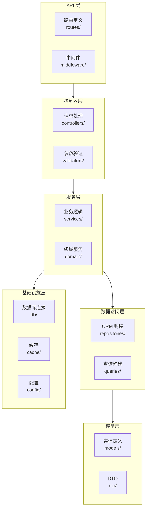

**目录结构**：

```
backend/
├── src/
│   ├── main.rs
│   ├── routes/           # 路由定义
│   │   ├── auth.rs
│   │   ├── user.rs
│   │   └── message.rs
│   ├── controllers/      # 控制器
│   │   ├── auth_controller.rs
│   │   ├── user_controller.rs
│   │   └── message_controller.rs
│   ├── services/         # 服务层
│   │   ├── auth_service.rs
│   │   ├── user_service.rs
│   │   └── message_service.rs
│   ├── repositories/     # 数据访问层
│   │   ├── user_repo.rs
│   │   └── message_repo.rs
│   ├── models/           # 模型
│   │   ├── user.rs
│   │   ├── message.rs
│   │   └── session.rs
│   ├── dto/              # 数据传输对象
│   │   ├── request.rs
│   │   └── response.rs
│   ├── middleware/       # 中间件
│   │   ├── auth.rs
│   │   └── logging.rs
│   ├── websocket/        # WebSocket
│   │   ├── server.rs
│   │   └── manager.rs
│   ├── db/               # 数据库
│   │   ├── pool.rs
│   │   └── connection.rs
│   ├── cache/            # 缓存
│   │   └── redis.rs
│   └── config/           # 配置
│       └── app.rs
```

---

## 4. UI 设计规范

### 4.1 可爱友好风格指南

#### 色彩系统

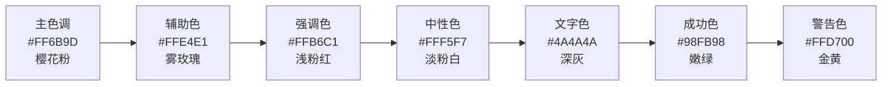

**CSS 变量定义**：

```css
:root {
  /* 主色调 */
  --color-primary: #FF6B9D;
  --color-primary-light: #FF8FB3;
  --color-primary-dark: #E55A8A;
  
  /* 辅助色 */
  --color-secondary: #FFE4E1;
  --color-accent: #FFB6C1;
  
  /* 中性色 */
  --color-bg: #FFF5F7;
  --color-surface: #FFFFFF;
  --color-text: #4A4A4A;
  --color-text-light: #888888;
  
  /* 功能色 */
  --color-success: #98FB98;
  --color-warning: #FFD700;
  --color-error: #FF6B6B;
  
  /* 圆角 */
  --radius-sm: 8px;
  --radius-md: 16px;
  --radius-lg: 24px;
  --radius-xl: 32px;
  
  /* 阴影 */
  --shadow-sm: 0 2px 8px rgba(255, 107, 157, 0.1);
  --shadow-md: 0 4px 16px rgba(255, 107, 157, 0.15);
  --shadow-lg: 0 8px 32px rgba(255, 107, 157, 0.2);
}
```

#### 组件设计规范

| 组件 | 设计要点 | 示例 |
|------|---------|------|
| **按钮** | 圆角 16px，渐变背景，悬停时轻微上浮 | `background: linear-gradient(135deg, #FF6B9D, #FF8FB3)` |
| **消息气泡** | 圆角 20px，发送方粉色，接收方白色 | `border-radius: 20px 20px 4px 20px` |
| **输入框** | 圆角 24px，淡粉色边框，聚焦时发光 | `border: 2px solid #FFE4E1` |
| **头像** | 圆形，带可爱边框，悬停时旋转 | `border: 3px solid #FFB6C1` |
| **图标** | 小清新风格，使用 Lucide 或自定义 SVG | 填充色 #FF6B9D |

#### 动画效果

```css
/* 消息发送动画 */
@keyframes messageSend {
  0% {
    transform: scale(0.8);
    opacity: 0;
  }
  50% {
    transform: scale(1.05);
  }
  100% {
    transform: scale(1);
    opacity: 1;
  }
}

.message-bubble {
  animation: messageSend 0.3s ease-out;
}

/* 消息接收动画 */
@keyframes messageReceive {
  0% {
    transform: translateX(-20px);
    opacity: 0;
  }
  100% {
    transform: translateX(0);
    opacity: 1;
  }
}

.message-bubble.received {
  animation: messageReceive 0.4s ease-out;
}

/* 按钮悬停动画 */
.button-cute {
  transition: all 0.3s cubic-bezier(0.4, 0, 0.2, 1);
}

.button-cute:hover {
  transform: translateY(-2px);
  box-shadow: 0 8px 20px rgba(255, 107, 157, 0.3);
}

/* 心跳动画 */
@keyframes heartbeat {
  0%, 100% {
    transform: scale(1);
  }
  50% {
    transform: scale(1.1);
  }
}

.icon-heart {
  animation: heartbeat 1.5s ease-in-out infinite;
}
```

### 4.2 主界面布局

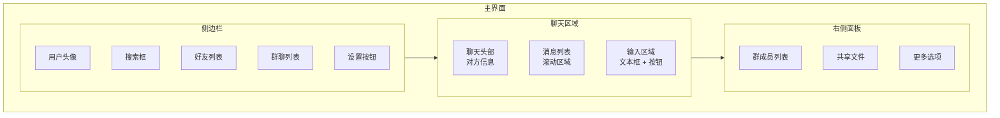

**布局实现（Vue + Tailwind）**：

```vue
<template>
  <div class="h-screen flex bg-gradient-to-br from-pink-50 to-pink-100">
    <!-- 侧边栏 -->
    <aside class="w-80 bg-white/80 backdrop-blur-sm rounded-r-3xl shadow-lg p-4">
      <div class="flex items-center gap-3 mb-6">
        <Avatar :src="user.avatar" size="large" />
        <div>
          <h3 class="font-bold text-gray-700">{{ user.name }}</h3>
          <p class="text-xs text-green-500">在线</p>
        </div>
      </div>
      
      <SearchInput v-model="searchQuery" placeholder="搜索好友..." />
      
      <Tabs v-model="activeTab" class="mt-4">
        <TabItem value="friends">好友</TabItem>
        <TabItem value="groups">群聊</TabItem>
      </Tabs>
      
      <ContactList :contacts="filteredContacts" @select="selectContact" />
    </aside>

    <!-- 聊天区域 -->
    <main class="flex-1 flex flex-col mx-4">
      <ChatHeader :contact="currentContact" />
      
      <MessageList :messages="messages" class="flex-1 overflow-y-auto" />
      
      <MessageInput @send="sendMessage" />
    </main>

    <!-- 右侧面板 -->
    <aside class="w-72 bg-white/80 backdrop-blur-sm rounded-l-3xl shadow-lg p-4">
      <GroupMembers v-if="isGroupChat" :members="currentContact.members" />
      <SharedFiles :files="sharedFiles" />
    </aside>
  </div>
</template>
```

### 4.3 消息气泡设计

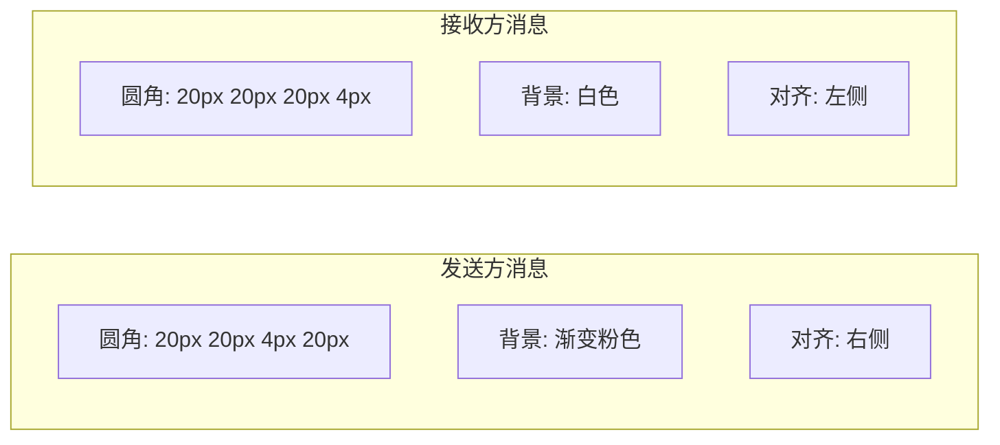

**Vue 组件实现**：

```vue
<template>
  <div :class="['message-bubble', isSent ? 'sent' : 'received']">
    <Avatar v-if="!isSent" :src="message.sender.avatar" size="small" />
    <div class="bubble-content">
      <p v-if="!isSent" class="sender-name">{{ message.sender.name }}</p>
      <div class="bubble">
        <template v-if="message.type === 'text'">
          {{ message.content }}
        </template>
        <template v-else-if="message.type === 'image'">
          
        </template>
        <template v-else-if="message.type === 'file'">
          <FileIcon :file="message" />
        </template>
      </div>
      <span class="message-time">{{ formatTime(message.timestamp) }}</span>
    </div>
  </div>
</template>

<style scoped>
.message-bubble {
  display: flex;
  gap: 8px;
  margin-bottom: 16px;
  animation: messageSend 0.3s ease-out;
}

.message-bubble.received {
  flex-direction: row;
}

.message-bubble.sent {
  flex-direction: row-reverse;
}

.bubble {
  max-width: 400px;
  padding: 12px 16px;
  border-radius: 20px;
  line-height: 1.5;
}

.message-bubble.sent .bubble {
  background: linear-gradient(135deg, #FF6B9D, #FF8FB3);
  color: white;
  border-radius: 20px 20px 4px 20px;
}

.message-bubble.received .bubble {
  background: white;
  color: #4A4A4A;
  border-radius: 20px 20px 20px 4px;
  box-shadow: 0 2px 8px rgba(0, 0, 0, 0.05);
}

.message-time {
  font-size: 11px;
  color: #888;
  margin-top: 4px;
}
</style>
```

---

## 5. 功能实现提示

### 5.1 前端实现提示

#### 建立 WebSocket 连接

```typescript
// composables/useWebSocket.ts
import { ref, onUnmounted } from 'vue'

export function useWebSocket(url: string) {
  const ws = ref<WebSocket | null>(null)
  const connected = ref(false)
  const reconnectTimer = ref<number | null>(null)

  const connect = () => {
    ws.value = new WebSocket(url)
    
    ws.value.onopen = () => {
      connected.value = true
      startHeartbeat()
    }
    
    ws.value.onclose = () => {
      connected.value = false
      stopHeartbeat()
      scheduleReconnect()
    }
    
    ws.value.onerror = (error) => {
      console.error('WebSocket error:', error)
    }
  }

  const send = (data: any) => {
    if (ws.value?.readyState === WebSocket.OPEN) {
      ws.value.send(JSON.stringify(data))
    }
  }

  const onMessage = (callback: (data: any) => void) => {
    if (ws.value) {
      ws.value.onmessage = (event) => {
        callback(JSON.parse(event.data))
      }
    }
  }

  // 心跳机制
  let heartbeatInterval: number
  const startHeartbeat = () => {
    heartbeatInterval = setInterval(() => {
      send({ type: 'ping' })
    }, 30000) // 30秒一次
  }

  const stopHeartbeat = () => {
    clearInterval(heartbeatInterval)
  }

  // 断线重连
  const scheduleReconnect = () => {
    reconnectTimer.value = window.setTimeout(() => {
      connect()
    }, 3000) // 3秒后重连
  }

  onUnmounted(() => {
    if (reconnectTimer.value) {
      clearTimeout(reconnectTimer.value)
    }
    stopHeartbeat()
    ws.value?.close()
  })

  return {
    ws,
    connected,
    connect,
    send,
    onMessage,
  }
}
```

#### 监听新消息

```typescript
// stores/message.ts
import { defineStore } from 'pinia'
import { useWebSocket } from '@/composables/useWebSocket'

export const useMessageStore = defineStore('message', () => {
  const messages = ref<Message[]>([])
  const { connect, onMessage } = useWebSocket('ws://localhost:8080/ws')

  const initWebSocket = () => {
    connect()
    onMessage((data) => {
      if (data.type === 'message') {
        messages.value.push(data.payload)
        playNotificationSound()
      }
    })
  }

  return {
    messages,
    initWebSocket,
  }
})
```

#### 发送消息

```typescript
// composables/useMessage.ts
import { useMessageStore } from '@/stores/message'
import { useWebSocket } from '@/composables/useWebSocket'

export function useMessage() {
  const messageStore = useMessageStore()
  const { send } = useWebSocket('ws://localhost:8080/ws')

  const sendMessage = (content: string, receiverId: string) => {
    const message = {
      type: 'message',
      payload: {
        content,
        receiver_id: receiverId,
        timestamp: Date.now(),
      },
    }
    send(message)
    
    // 乐观更新
    messageStore.messages.push({
      id: generateId(),
      content,
      sender_id: 'current_user',
      receiver_id: receiverId,
      timestamp: Date.now(),
      status: 'sending',
    })
  }

  return {
    sendMessage,
  }
}
```

### 5.2 后端实现提示

#### 处理 WebSocket 连接

```rust
// websocket/manager.rs
use std::collections::HashMap;
use std::sync::{Arc, Mutex};
use actix::prelude::*;
use actix_web_actors::ws;

#[derive(Message)]
#[rtype(result = "()")]
pub struct Connect {
    pub addr: Recipient<ws::Message>,
    pub user_id: String,
}

#[derive(Message)]
#[rtype(result = "()")]
pub struct Disconnect {
    pub user_id: String,
}

#[derive(Message)]
#[rtype(result = "()")]
pub struct Message {
    pub user_id: String,
    pub msg: String,
}

pub struct ConnectionManager {
    connections: HashMap<String, Recipient<ws::Message>>,
}

impl ConnectionManager {
    pub fn new() -> Self {
        Self {
            connections: HashMap::new(),
        }
    }
}

impl Actor for ConnectionManager {
    type Context = Context<Self>;
}

impl Handler<Connect> for ConnectionManager {
    type Result = ();

    fn handle(&mut self, msg: Connect, _ctx: &mut Self::Context) {
        self.connections.insert(msg.user_id, msg.addr);
        println!("User {} connected", msg.user_id);
    }
}

impl Handler<Disconnect> for ConnectionManager {
    type Result = ();

    fn handle(&mut self, msg: Disconnect, _ctx: &mut Self::Context) {
        self.connections.remove(&msg.user_id);
        println!("User {} disconnected", msg.user_id);
    }
}

impl Handler<Message> for ConnectionManager {
    type Result = ();

    fn handle(&mut self, msg: Message, _ctx: &mut Self::Context) {
        if let Some(addr) = self.connections.get(&msg.user_id) {
            let _ = addr.do_send(ws::Message::text(msg.msg));
        }
    }
}
```

#### 推送新消息

```rust
// websocket/server.rs
use actix::{Addr};
use actix_web::{web, HttpRequest, HttpResponse};
use actix_web_actors::ws;

pub async fn websocket_route(
    req: HttpRequest,
    stream: web::Payload,
    manager: web::Data<Addr<ConnectionManager>>,
) -> Result<HttpResponse, Error> {
    let ws = MyWebSocket::new(manager.get_ref().clone());
    ws::start(ws, &req, stream)
}

struct MyWebSocket {
    manager: Addr<ConnectionManager>,
    user_id: String,
}

impl MyWebSocket {
    fn new(manager: Addr<ConnectionManager>) -> Self {
        Self {
            manager,
            user_id: String::new(),
        }
    }
}

impl StreamHandler<Result<ws::Message, ws::ProtocolError>> for MyWebSocket {
    fn handle(&mut self, msg: Result<ws::Message, ws::ProtocolError>, ctx: &mut Self::Context) {
        match msg {
            Ok(ws::Message::Ping(msg)) => {
                ctx.pong(&msg);
            }
            Ok(ws::Message::Text(text)) => {
                // 处理接收到的消息
                let message: ClientMessage = serde_json::from_str(&text).unwrap();
                
                if message.type == "message" {
                    // 存储到数据库
                    // ...
                    
                    // 推送给接收方
                    self.manager.do_send(Message {
                        user_id: message.receiver_id,
                        msg: text,
                    });
                }
            }
            _ => (),
        }
    }
}

impl Handler<ws::Message> for MyWebSocket {
    type Result = ();

    fn handle(&mut self, msg: ws::Message, ctx: &mut Self::Context) {
        ctx.text(msg);
    }
}
```

#### 存储聊天记录

```rust
// repositories/message_repo.rs
use sea_orm::{EntityTrait, ActiveModelTrait, DatabaseConnection};
use entity::message;

pub struct MessageRepository {
    db: DatabaseConnection,
}

impl MessageRepository {
    pub fn new(db: DatabaseConnection) -> Self {
        Self { db }
    }

    pub async fn create(&self, msg: &CreateMessageDto) -> Result<message::Model, DbErr> {
        let active_msg = message::ActiveModel {
            id: Set(Uuid::new_v4()),
            sender_id: Set(msg.sender_id.clone()),
            receiver_id: Set(msg.receiver_id.clone()),
            content: Set(msg.content.clone()),
            message_type: Set(msg.message_type.clone()),
            timestamp: Set(msg.timestamp),
            ..Default::default()
        };

        active_msg.insert(&self.db).await
    }

    pub async fn get_history(
        &self,
        user_id: &str,
        contact_id: &str,
        limit: u64,
    ) -> Result<Vec<message::Model>, DbErr> {
        message::Entity::find()
            .filter(
                Condition::any()
                    .add(message::Column::SenderId.eq(user_id))
                    .add(message::Column::ReceiverId.eq(user_id))
            )
            .filter(
                Condition::any()
                    .add(message::Column::SenderId.eq(contact_id))
                    .add(message::Column::ReceiverId.eq(contact_id))
            )
            .order_by_desc(message::Column::Timestamp)
            .limit(limit)
            .all(&self.db)
            .await
    }
}
```

---

## 6. 数据模型设计

### 6.1 数据库表设计

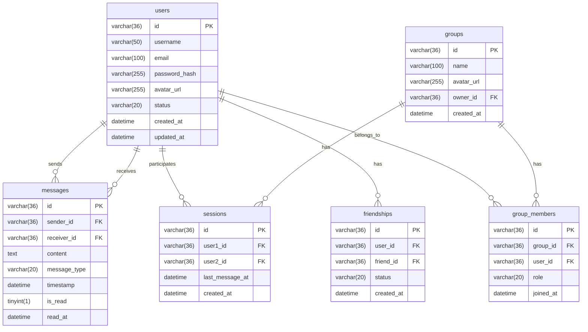

### 6.2 Rust 模型定义

```rust
// models/user.rs
use serde::{Serialize, Deserialize};
use sea_orm::entity::prelude::*;

#[derive(Clone, Debug, PartialEq, DeriveEntityModel, Serialize, Deserialize)]
#[sea_orm(table_name = "users")]
pub struct Model {
    #[sea_orm(primary_key)]
    pub id: Uuid,
    pub username: String,
    pub email: String,
    pub password_hash: String,
    pub avatar_url: Option<String>,
    pub status: String,
    pub created_at: DateTime,
    pub updated_at: DateTime,
}

#[derive(Copy, Clone, Debug, EnumIter, DeriveRelation)]
pub enum Relation {}

impl ActiveModelBehavior for ActiveModel {}
```

```rust
// models/message.rs
use serde::{Serialize, Deserialize};
use sea_orm::entity::prelude::*;

#[derive(Clone, Debug, PartialEq, DeriveEntityModel, Serialize, Deserialize)]
#[sea_orm(table_name = "messages")]
pub struct Model {
    #[sea_orm(primary_key)]
    pub id: Uuid,
    pub sender_id: Uuid,
    pub receiver_id: Uuid,
    pub content: String,
    pub message_type: String,
    pub timestamp: DateTime,
    pub is_read: bool,
    pub read_at: Option<DateTime>,
}

#[derive(Copy, Clone, Debug, EnumIter, DeriveRelation)]
pub enum Relation {
    #[sea_orm(
        belongs_to = "super::user::Entity",
        from = "Column::SenderId",
        to = "super::user::Column::Id"
    )]
    Sender,
    #[sea_orm(
        belongs_to = "super::user::Entity",
        from = "Column::ReceiverId",
        to = "super::user::Column::Id"
    )]
    Receiver,
}

impl ActiveModelBehavior for ActiveModel {}
```

### 6.3 TypeScript 类型定义

```typescript
// types/index.ts
export interface User {
  id: string
  username: string
  email: string
  avatar_url?: string
  status: 'online' | 'offline' | 'away'
  created_at: string
  updated_at: string
}

export interface Message {
  id: string
  sender_id: string
  receiver_id: string
  content: string
  message_type: 'text' | 'image' | 'file' | 'voice'
  timestamp: number
  is_read: boolean
  read_at?: number
  sender?: User
}

export interface Session {
  id: string
  user1_id: string
  user2_id: string
  last_message_at: string
  created_at: string
}

export interface Group {
  id: string
  name: string
  avatar_url?: string
  owner_id: string
  created_at: string
}

export interface GroupMember {
  id: string
  group_id: string
  user_id: string
  role: 'owner' | 'admin' | 'member'
  joined_at: string
}
```

---

## 7. 消息协议设计

### 7.1 WebSocket 消息格式

```typescript
// types/protocol.ts
export interface WSMessage {
  type: 'ping' | 'pong' | 'message' | 'ack' | 'typing' | 'read'
  payload?: any
  request_id?: string
}

// 消息类型
export interface MessagePayload {
  id: string
  sender_id: string
  receiver_id: string
  content: string
  message_type: 'text' | 'image' | 'file' | 'voice'
  timestamp: number
}

// 确认消息
export interface AckPayload {
  message_id: string
  status: 'received' | 'read'
  timestamp: number
}

// 正在输入
export interface TypingPayload {
  user_id: string
  is_typing: boolean
}

// 已读回执
export interface ReadPayload {
  message_ids: string[]
  timestamp: number
}
```

### 7.2 消息流转时序

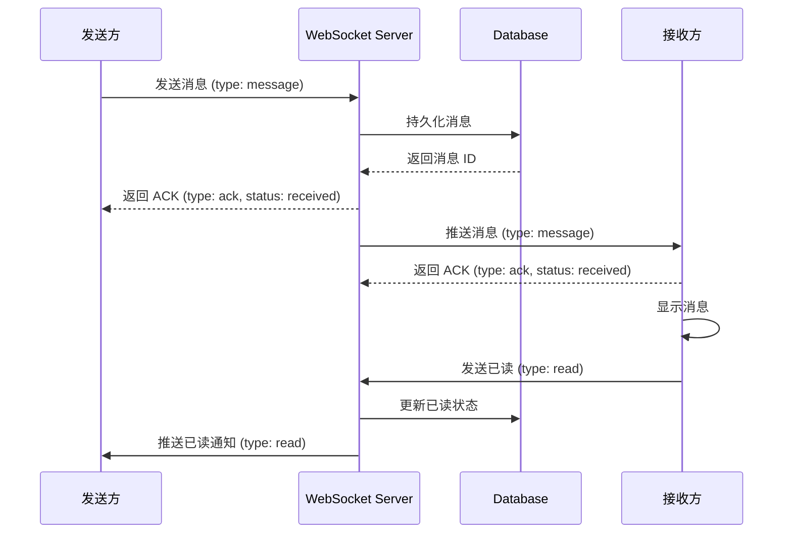

---

## 8. 开发规范

### 8.1 前端代码规范

- **组件命名**：PascalCase（如 `MessageBubble.vue`）
- **文件命名**：kebab-case（如 `use-websocket.ts`）
- **样式**：使用 Tailwind CSS 或 Scoped CSS
- **类型**：使用 TypeScript 严格模式
- **提交规范**：`feat:`, `fix:`, `docs:`, `style:`, `refactor:`, `test:`

### 8.2 后端代码规范

- **命名**：snake_case（如 `message_repository.rs`）
- **错误处理**：使用 `Result<T, E>` 和 `thiserror`
- **日志**：使用 `tracing` crate
- **测试**：单元测试 + 集成测试
- **文档**：使用 `rustdoc` 注释

---

## 9. 后续扩展

### 9.1 功能扩展

- 端到端加密（E2EE）
- 音视频通话（WebRTC）
- 屏幕共享
- 消息撤回和编辑
- @提及和回复
- 消息搜索
- 消息翻译
- 机器人集成

### 9.2 性能优化

- 消息分页加载
- 图片懒加载和压缩
- WebSocket 连接复用
- CDN 加速
- 数据库读写分离
- Redis 缓存优化

---

> **文档维护**：本文档将随着项目进展持续更新，请定期同步最新版本。
