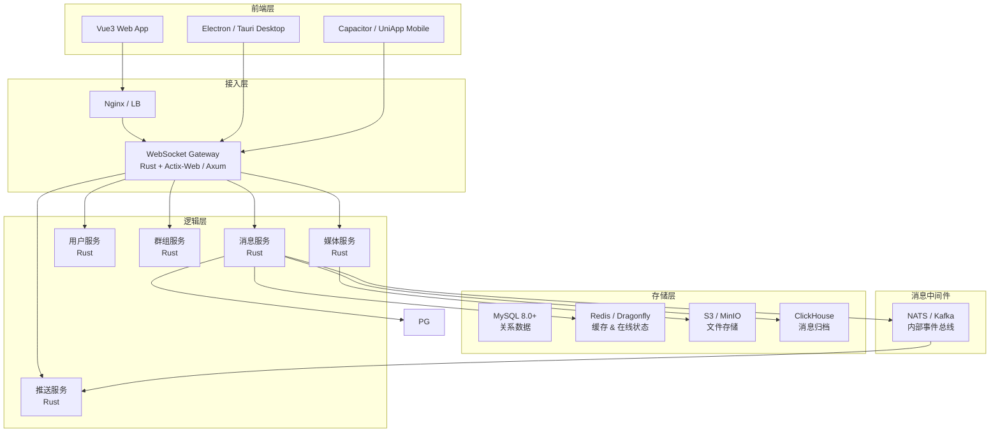
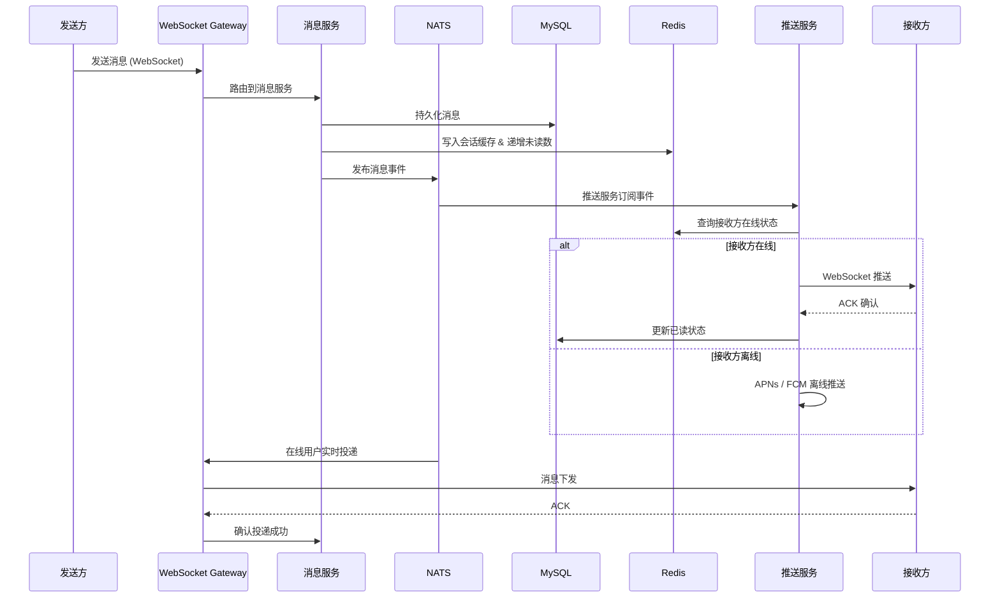
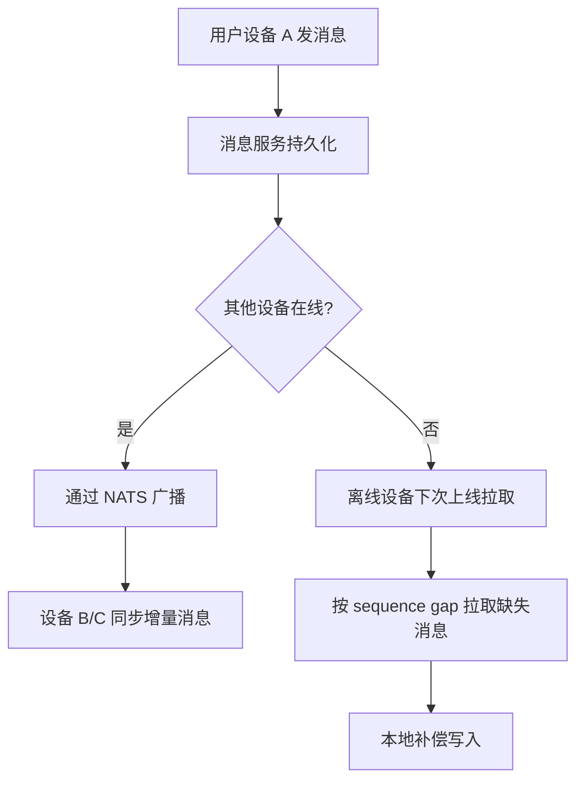
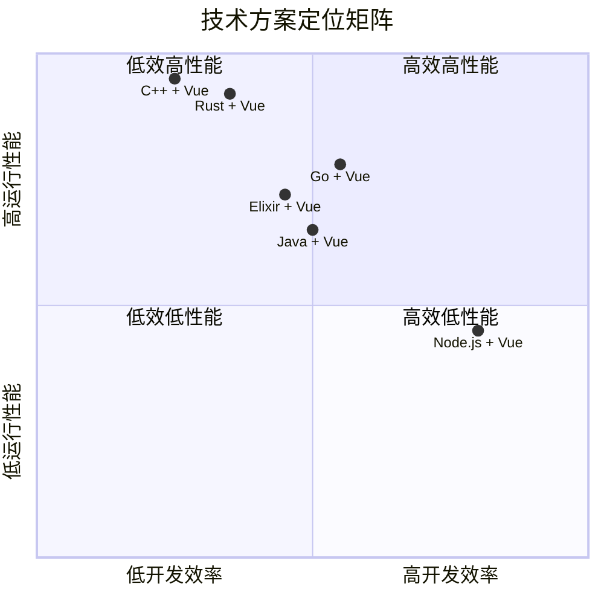
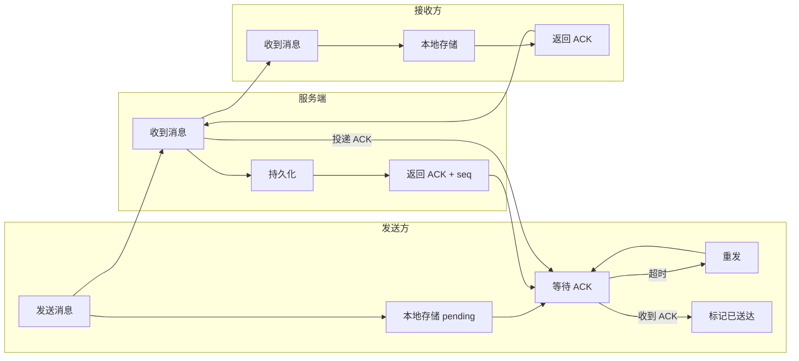
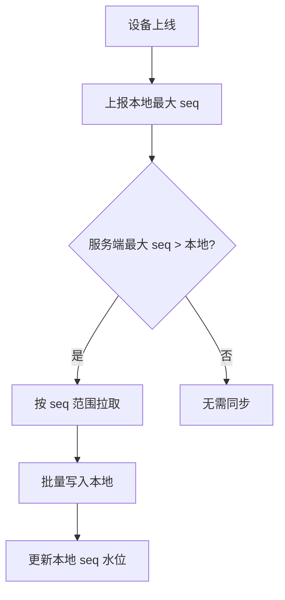
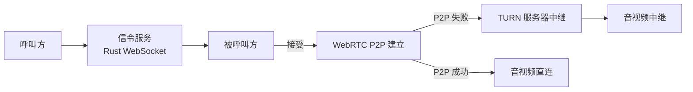
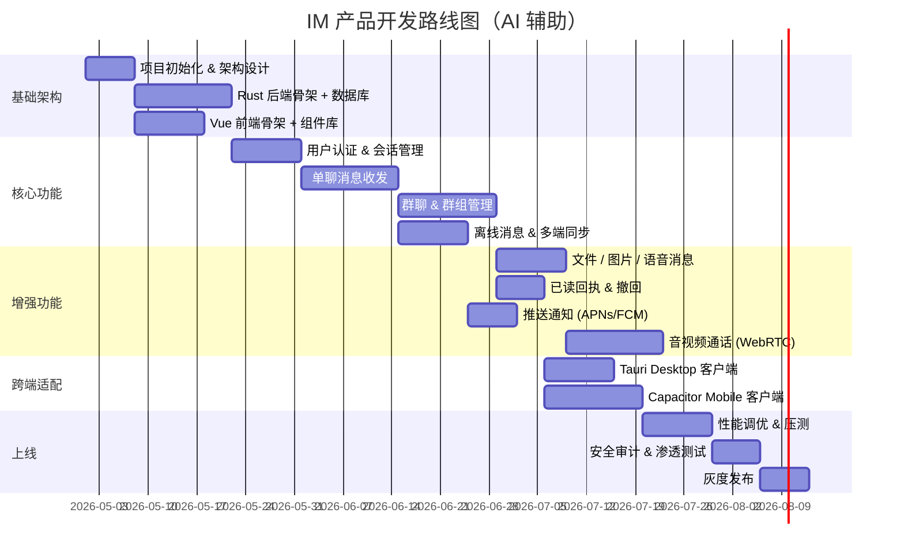

# 全栈全端 IM 即时通信产品 — 技术方案可行性评估报告

> 评估日期：2026-04-26  
> 评估前提：基于 AI 辅助编程，技术能力学习成本不作为主要约束

---

## 1. 项目概述

构建一个**全栈全端 IM 即时通信产品**，需覆盖以下核心能力：

- 实时消息收发（文本 / 图片 / 文件 / 音视频）
- 多端同步（Web / Desktop / Mobile）
- 离线消息推送与同步
- 群组、好友、会话管理
- 消息已读回执、撤回、引用
- 高并发、低延迟、消息可靠投递

---

## 2. Rust 后端 + Vue 前端方案详解

### 2.1 整体架构

### 2.2 Rust 后端技术选型

| 模块 | 推荐方案 | 备选方案 | 说明 |
|------|---------|---------|------|
| HTTP/WebSocket 框架 | **Axum** | Actix-Web | Axum 生态与 Tokio 深度集成，tower 中间件丰富 |
| 异步运行时 | **Tokio** | async-std | 事实标准，生态最完善 |
| 数据库 ORM | **SeaORM** | Diesel | SeaORM 异步原生，适合高并发场景 |
| 消息队列 | **NATS** | Kafka / RabbitMQ | NATS 轻量高性能，适合 IM 内部事件路由 |
| 缓存 | **Redis** | Dragonfly | 成熟稳定，支持 Pub/Sub |
| gRPC | **Tonic** | — | 微服务间通信 |
| 序列化 | **Protobuf** | MessagePack | 消息体紧凑，跨语言友好 |

### 2.3 Vue 前端技术选型

| 模块 | 推荐方案 | 说明 |
|------|---------|------|
| 框架 | **Vue 3 + Composition API** | 类型安全、逻辑复用 |
| 构建工具 | **Vite** | 极速 HMR |
| 状态管理 | **Pinia** | 轻量、TS 友好 |
| UI 组件库 | **Naive UI** / **PrimeVue** | 支持暗色主题、自定义主题 |
| WebSocket 客户端 | 封装自研 + 心跳重连 | 需处理断线重连、消息队列 |
| 跨端方案 | **Tauri** (Desktop) + **Capacitor** (Mobile) | Tauri 用 Rust 侧边栏，体积小性能好 |

### 2.4 消息流转核心流程

### 2.5 多端同步机制

### 2.6 可行性评估

| 维度 | 评分 | 说明 |
|------|------|------|
| **性能** | ⭐⭐⭐⭐⭐ | Rust 零成本抽象 + 无 GC，单机可支撑 50W+ WebSocket 连接 |
| **内存安全** | ⭐⭐⭐⭐⭐ | 编译期保证，无数据竞争，IM 场景至关重要 |
| **延迟** | ⭐⭐⭐⭐⭐ | P99 < 10ms（服务端内部），全链路 < 100ms |
| **生态成熟度** | ⭐⭐⭐⭐ | Axum/Tokio/SeaORM 已生产可用，但 IM 领域轮子需自建 |
| **AI 辅助开发效率** | ⭐⭐⭐⭐ | Rust 编译器严格，AI 生成代码需多次迭代修正；但 Vue 侧效率极高 |
| **跨端覆盖** | ⭐⭐⭐⭐ | Tauri + Capacitor 可覆盖三大平台，但移动端 Tauri 尚在成熟中 |
| **运维复杂度** | ⭐⭐⭐ | Rust 编译慢、调试需 gdb/lldb，但部署为单二进制，运维简洁 |

---

## 3. 竞品技术方案对比

### 3.1 方案总览

### 3.2 详细对比表

| 维度 | Rust + Vue | Go + Vue | Java (Spring) + Vue | Node.js + Vue | Elixir + Vue |
|------|-----------|----------|---------------------|---------------|--------------|
| **并发模型** | async/await (M:N) | goroutine (M:N) | 虚拟线程 / 线程池 | 单线程事件循环 | Actor (BEAM VM) |
| **单机 WS 连接** | 50W+ | 30W+ | 10W+ | 5W+ | 20W+ |
| **内存占用** | 极低 | 低 | 高 | 中 | 低 |
| **GC 暂停** | 无 | 有 (<1ms) | 有 (可调优) | 有 (V8) | 无 (BEAM) |
| **热更新** | 不支持 | 不支持 | 支持 | 支持 | 原生支持 |
| **编译速度** | 慢 (5-15min) | 快 (<30s) | 中 (1-3min) | 无编译 | 快 |
| **AI 生成代码可用率** | ~70% | ~85% | ~80% | ~90% | ~65% |
| **IM 开源参考** | 较少 | 较多 (OpenIM) | 多 (Tinder) | 多 (Rocket.Chat) | 少 (VerneMQ) |
| **学习曲线** | 陡峭 | 平缓 | 中等 | 低 | 中等 |
| **跨端一致性** | Tauri 共享 Rust 逻辑 | Wails | Electron | Electron | N/A |
| **部署物** | 单二进制 | 单二进制 | JAR + JVM | Node 运行时 | BEAM release |

### 3.3 各方案优劣分析

#### Rust + Vue（推荐方案）

- **优势**：极致性能、内存安全、无 GC 停顿、Tauri 前后端语言统一
- **劣势**：编译慢、AI 生成代码需更多迭代、IM 领域生态薄弱需自建
- **AI 辅助下的可行性**：**高** — 编译器严格反而帮助 AI 发现错误，迭代修正后代码质量极高

#### Go + Vue（最强竞品）

- **优势**：goroutine 天然适合高并发、编译快、IM 开源生态丰富（OpenIM/Open-IM-Server）
- **劣势**：GC 暂停对极低延迟场景有影响、错误处理冗长
- **AI 辅助下的可行性**：**高** — AI 生成 Go 代码可用率最高

#### Java + Vue

- **优势**：生态最成熟、热更新、JVM 调优空间大
- **劣势**：内存占用大、启动慢、IM 场景需大量调优
- **AI 辅助下的可行性**：**中高** — Spring Boot 脚手架成熟，AI 可快速生成 CRUD

#### Node.js + Vue

- **优势**：前后端语言统一、AI 生成代码可用率最高、开发速度最快
- **劣势**：单线程瓶颈、内存泄漏风险、不适合大规模 IM
- **AI 辅助下的可行性**：**高** — 但仅适合中小规模 MVP

#### Elixir + Vue

- **优势**：BEAM VM 天生适合 IM（Actor 模型、热更新、容错）
- **劣势**：社区小、AI 生成代码可用率低、招聘难（AI 编程下此劣势弱化）
- **AI 辅助下的可行性**：**中** — AI 对 Elixir 理解较弱

---

## 4. 关键技术挑战与解法

### 4.1 消息可靠投递

**核心策略**：
- 全局递增 `sequence` 号，客户端按 gap 拉取
- 发送方本地 pending 队列 + 超时重发
- 服务端幂等写入，ACK 确认闭环

### 4.2 离线消息同步

### 4.3 端到端加密（可选）

若需 E2EE，推荐 **Double Ratchet Algorithm**（Signal 协议）：
- Rust 侧：使用 `x25519-dalek` + `aes-gcm` crate
- Vue 侧：使用 `libsodium-wrappers`
- 密钥交换通过 X3DH 协议完成

### 4.4 音视频通话

- 信令：通过现有 WebSocket 通道传输 SDP/ICE
- 媒体：WebRTC P2P，失败回退 TURN
- Rust 侧可选 `webrtc-rs` 做 SFU（选择性转发单元）

---

## 5. 项目实施路线图

---

## 6. 结论与建议

### 6.1 最终推荐

| 场景 | 推荐方案 | 理由 |
|------|---------|------|
| **追求极致性能 & 长期技术壁垒** | **Rust + Vue** ⭐ | 无 GC、内存安全、Tauri 跨端统一语言 |
| **快速 MVP + 平衡性能** | Go + Vue | goroutine 并发模型、IM 生态丰富 |
| **小规模产品 / 快速验证** | Node.js + Vue | 前后端统一、AI 生成效率最高 |

### 6.2 Rust + Vue 方案关键建议

1. **先 MVP 后优化**：首版用 Axum + SeaORM + MySQL 快速搭建，性能瓶颈出现后再拆微服务
2. **消息协议优先 Protobuf**：前后端共享 `.proto` 定义，AI 可直接生成两端代码
3. **Tauri 优先 Desktop 端**：Tauri 2.0 已支持移动端，长期可统一跨端方案
4. **AI 编程策略**：Rust 侧采用"小步快跑"— 每次让 AI 生成小模块，编译验证后迭代，避免大段代码编译错误堆积
5. **压测先行**：使用 `tokio-console` + `wrk` 在开发早期建立性能基线

### 6.3 风险提示

- **Rust 编译时间**：全量编译可能 10min+，建议使用 `sccache` + 增量编译缓解
- **Tauri 移动端成熟度**：截至 2026 年，Tauri 移动端仍需评估，备选 Capacitor
- **IM 领域轮子少**：消息去重、ID 生成（Snowflake）、会话合并等需自建，AI 可加速但需人工审查

---

> **总结**：在 AI 辅助编程前提下，Rust + Vue 方案**完全可行**，且在性能、安全性、长期维护成本上具有显著优势。主要代价在于 Rust 编译慢和 AI 生成代码的迭代修正成本，但这在 AI 辅助下可被有效缓解。建议采用，并按路线图分阶段推进。
